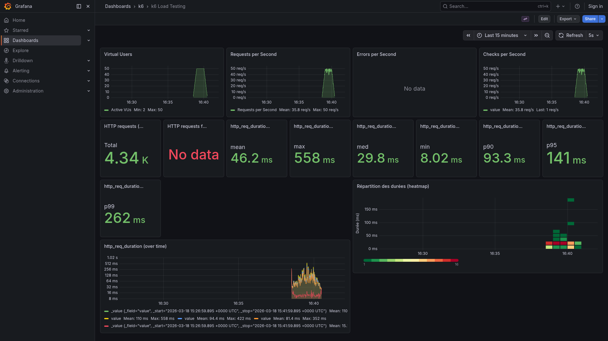
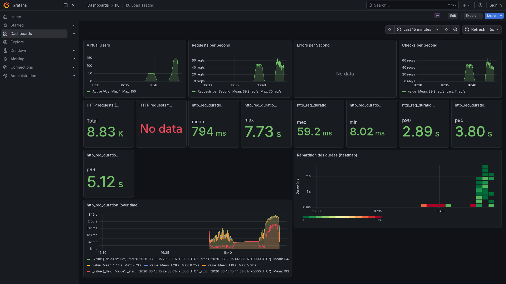
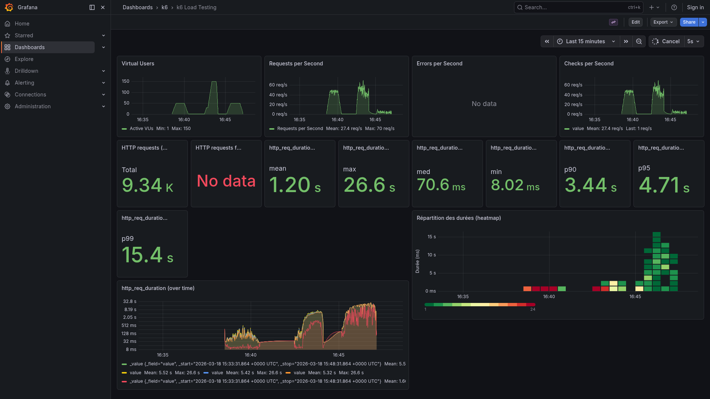
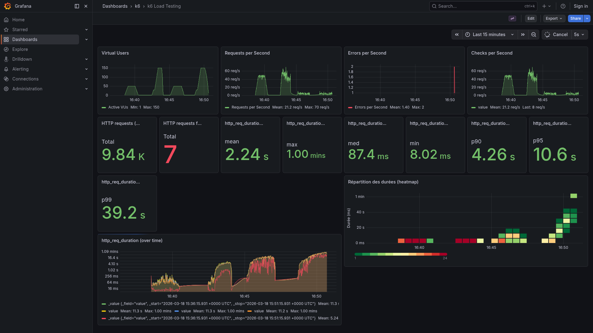

# Synthèse Globale des Tests de Performance (FilmApi)

Ce document rassemble les observations des 4 scénarios de test exécutés avec k6 (Load et Spike, sur **50 000** et **500 000** films).

## 1. Load Test - 50k Films (`task load-50k`)

- **Latence (Duration)** : P95 à 140.5 ms, Moyenne à 46.16 ms. Les temps de réponse sont excellents. L'API est très réactive en dessous de 200 ms.
- **Taux de succès** : 0.00% d'erreurs (aucune requête échouée sur 4336).
- **Débit (Throughput)** : ~35.86 requêtes par seconde, ce qui démontre la capacité du système à encaisser le load avec 50 VUs soutenus.
- **Capture Dashboard** : 

## 2. Spike Test - 50k Films (`task spike-50k`)

- **Pic de charge (VUs)** : 150 VUs atteints subitement.
- **Latence (Duration)** : Dégradation visible, le P95 grimpe à 4.45s (max 7.73s). Le systèmeature temporairement sous le choc mais la résilience est vérifiée sans décrochage complet.
- **Erreurs** : 0.00% d'erreurs (0 échec sur 4492 requêtes).
- **Capture Dashboard** : 

## 3. Load Test - 500k Films (`task load-500k`)

- **Latence (Duration)** : Chute massive des performances avec la grande base : P95 à 20.30s et moyenne à 8.24s. Indice très clair qu'il manque des indexs MongoDB pertinents (ex: Full scan lors des requêtes de pagination ou filtres).
- **Taux de succès** : 0.00% d'erreurs malgré la lenteur. Les délais s'allongent mais le serveur HTTP tient la connexion.
- **Débit (Throughput)** : Effondrement à ~4.25 requêtes par seconde comparé aux 35/s du 50k.
- **Capture Dashboard** : 

## 4. Spike Test - 500k Films (`task spike-500k`)

- **Pic de charge (VUs)** : Montée brutale à 150 VUs, combinée à une volumétrie massive en base de données de 500 000 entrées.
- **Latence (Duration)** : Saturation extrême. Le P95 atteint la barre très critique de 30.56s (max 33.15s). Le système devient complètement inutilisable sous cette pression combinée.
- **Erreurs** : **2.59% d'erreurs** (13 échecs sur 502 tentatives). Conséquence directe : des timeouts HTTP et/ou rejets forcent la perte de quelques requêtes, brisant la fiabilité de l'API.
- **Capture Dashboard** : 
